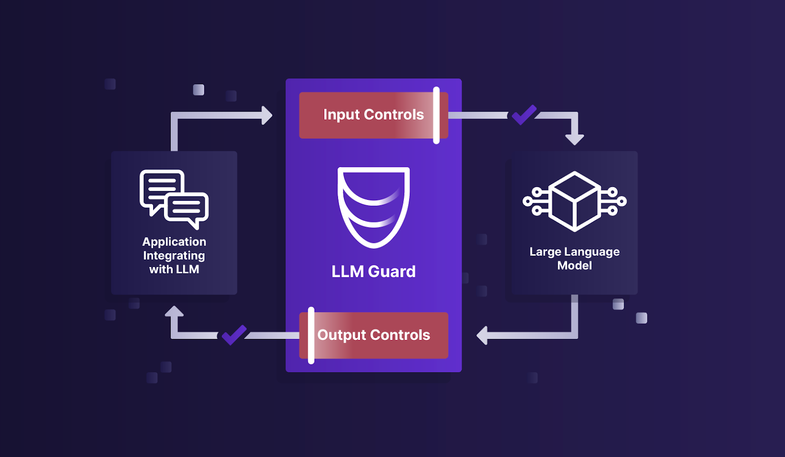

# LLM Guard Solution PoC

## Overview

This solution PoC leverages the [LLM Guard](https://llm-guard.com/) capabilities to protect large language models offered by various AI vendors like Azure OpenAI, Anthropic, Bard etc.

## High Level Architecture




## Solution Components and Implementation

### Components

- Large language model: gpt-35-turbo
- Hosting service: Azure OpenAI service
- Docker based LLM Guard API hosted on an AWS c5a.8xlarge EC2 instance due to the requirement of at least 16GB of RAM
- AI powered application

### Implementation

#### LLM Guard API Deployment on EC2 Ubuntu

```bash
git clone https://github.com/protectai/llm-guard.git
sudo apt update
sudo apt install python3-pip
sudo ln -s /usr/bin/python3 /usr/bin/python
sudo apt install docker.io
sudo docker pull laiyer/llm-guard-api:latest
sudo docker run --name aidefender -d -p 8000:8000 -e LOG_LEVEL='DEBUG' -e AUTH_TOKEN='<LLM_GUARD_API_KEY>' -v ./config:/home/user/app/config laiyer/llm-guard-api:latest
```

#### Direct Azure OpenAI Model Access Script

 demonstrates access to Azure OpenAI model directly using Azure SDK without using LLM Guard.

#### LLM Guard API Usage Script

 demonstrates the usage of LLM Guard capabilities via API calls.

#### AI Powered Application and LLM Guard Integration Script

 demonstrates the usage of LLM Guard capabilities via API calls.
